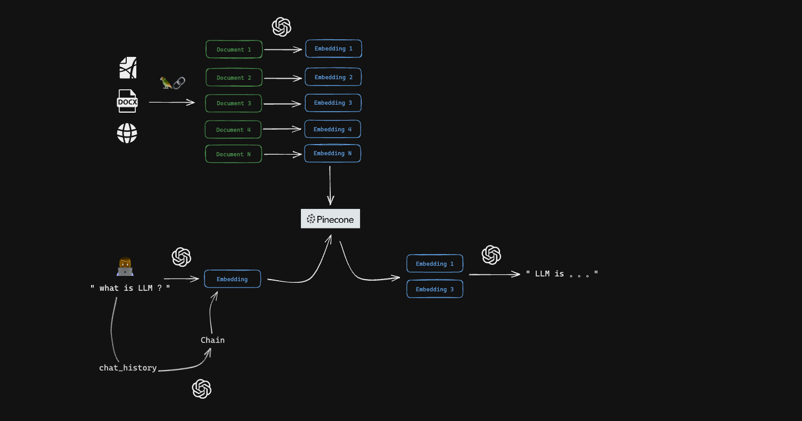
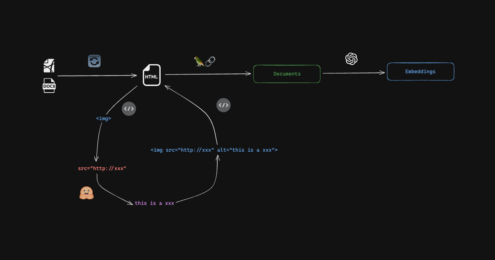

<br />

<p align="center">
   
</p>

<h3 align="center">
  <samp>
    talk-with-docs
  </samp>
</h3>

<p align="center">
  <samp>
    use 🦜️🔗 to communicate with varied files or web
  </samp>
</p>

<br />

## Start
```bash
git clone https://github.com/codeacme17/talk-with-docs.git
```

#### UI
```bash
cd talk-with-docs
pnpm install
pnpm dev
```

#### Server
```bash
cd talk-with-docs/server
pnpm install
pnpm dev
```

#### Add the required environment variables 
```bash
cd talk-with-docs/server
touch .env
open .env
```
```py
# openai
OPENAI_API_KEY = "..." 

# Pinecone
PINECONE_API_KEY="..."
PINECONE_ENVIRONMENT="..."
PINECONE_INDEX="..."

# Huggingface
HUGGINGFACE_API_KEY="..."

# Proxy 
# If you need a network proxy to access openai, 
# please change this configuration item to your proxy address
SOCKS5_PROXY_ADDRESS="socks5://..."
```

## Support type
|       | type | suffix |  describe  |
|-------|------|------|--|
|   ☑️   |word  |  `.doc` `.docx`    |  only `.docx` files support in-document image parsing  | 
|   ☑️   |pdf  |  `.pdf`    |  not support  image parsing  | 
|   ☑️   |HTML  |  `.html`  |  support  image parsing  | 
|   ☑️   |image  |  `.png` `.jpg` `.webp`    |    | 
|   ☑️   |web  |     | just use `url`   | 
|   📌   |audio  |      |  `pending dev...`  | 
|   📌   |video  |  |  `pending dev...`      | 


## How it work

#### embedding
 

#### explain image
 


## Contributing
Contributions to the project are welcome! If you find a bug or have an idea for a new feature, please submit an issue or pull request.

## License
[MIT](https://github.com/codeacme17/1llg-terminal-GPT/blob/main/LICENSE) License © 2023-Present [leyoonafr](https://github.com/codeacme17)

